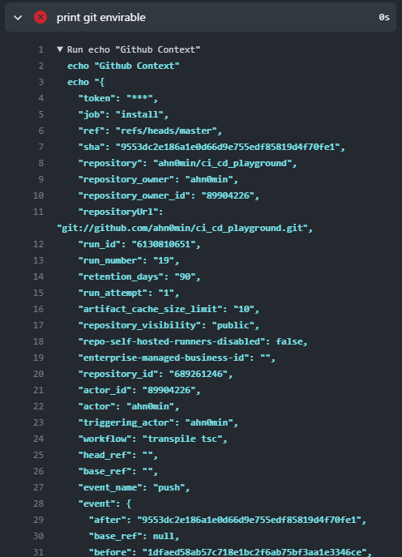
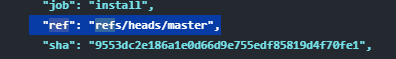

### 만난 에러 상황들

1. 들여쓰기 문제로 인한 에러

`-name` 하단에 `run` 에서 들여쓰기를 꼭 해줘야한다.

```
  steps:
    runs-on: ubuntu-latest

    - name: 타입스크립트를 인스톨하는 step
        run: tsc -v # fail ❌

    - name: 타입스크립트를 인스톨 하는 setp
        run: tsc -v # success ✅
```

2. n개의 Job을 사용할때 발생했던 이슈

이 2개의 Job을 사용할 때 1번 Job에서 진행된 결과물이 2번 Job에서는 접근하지 못했다.


needs를 하면 될 줄 알았으나 폴더 내용이 다른건 똑같다.
즉 종속성만을 그대로 넘겨받고 이전 Job에서의 새롭게 추가된 폴더나 파일등은 접근하지 못한다.


> 즉 각각의 Job들은 격리된 환경에서 이루어지고 있는 것이었다.
> 해결하는 방법이 있긴하지만 지금 단계에서는 넘어가려고한다.

3. 나는 Github Context를 보고싶었다.

```
  - name: print Github Context
    run |
    echo "Github Context"
    echo  "${{ toJson(github) }}"
    | jq
```

이렇게 json으로 바꿔서 문자열로 출력하려 했다 생각보다 잘 나왔고 중간에 `pare error`가 뜨긴 했지만 뭐 나쁘지 않은 결과였다. (보고만 싶었기 때문에)


내가 원하는 정보 어떤 job



Permission 권한을 줘야하는것 같다.. 2ㅣㅅ간동안했는데..
